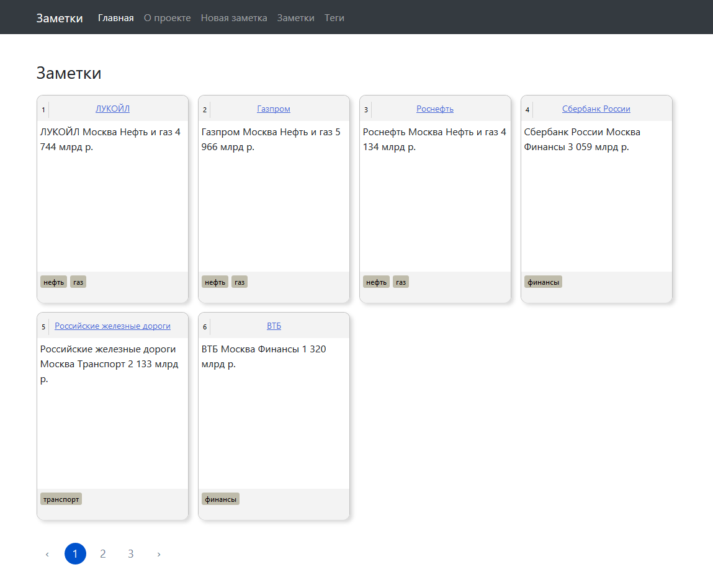

# jnotes-client

Заметки на React + Redux

На основе 

Веб-клиент для rest-api 

## Установка

Cтавим yarn, если не установлен
```bash
npm install --global yarn
```

Инсталяция приложения
```bash
cd jnotes-client

yarn
```

## Запуск dev-сервера

```bash
yarn start
```

## Сборка

```bash
yarn build
```

## Скриншот
